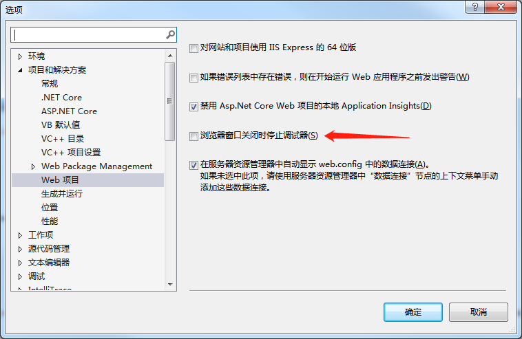
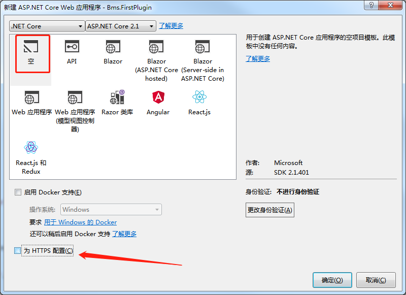

# Webex

## Webex 是什么？

Webex 是一套基于 `.NET Core 2.1` 的 Web 应用框架，用于构建可复用插件化开发的平台。

## 知识点

Webex 涉及了以下几个知识点：

- [.NET Core](https://dotnet.github.io/)：是.NET Framework的新一代版本。
- [VueJS](https://vuejs.org/)：是一套用于构建用户界面的渐进式框架。
- [Less](http://www.dotlesscss.org/)： 是一门 CSS 预处理语言。
- [ElementUI](http://element.eleme.io/)： 一套基于 Vue 的后端 UI 框架。

## 快速上手

本节将介绍如何使用 Webex。

[点此安装 .NET Core SDK](https://www.microsoft.com/net/download/thank-you/dotnet-sdk-2.1.401-windows-x64-installer)。

 > **特别注意**：为了更好的使用 Visual Studio 2017 进行调试，请将取消 [工具] -> [选项] -> [项目和解决方案] -> [浏览器窗口关闭时停止调试器] 前的复选框。



### 使用脚手架

使用 git 克隆脚手架项目：[clone WebexStarter](https://gitee.com/qiyukeji/WebexStarter)。

目录结构：

	src\
		plugins\..
		Webex.Platform\..
		Webex.Platform.Core\..
		Webex.Platform.Filters\..

脚手架包括默认的五个 .NET Core 项目。其中：

- `src\Webex.Platform`：主平台项目，一般用于整体调试和发布使用。
- `src\Webex.Platform.Core`：核心类库项目，有关于整体平台所需的公共内容均放置于此。
- `src\Webex.Platform.Filters`：平台筛选器项目，用于平台运行时所需的执行上下文捕获及后台服务，其核心是两个接口的实现：
	- **IPluginMiddleware**：插件中间件，用于 Plugin API 执行所需的执行上下文捕获、异常捕获，一般用于鉴权、第三方登录等操作。
	- **IPluginBackgroundService**：插件后台服务，用于定时执行业务服务，如定时发送邮件、报表、任务作业等。
	- **IPluginFilter**：这是一个上述两个接口的根接口，如自定义了筛选器，可通过获取服务 `IPluginFilterProvider.Filters` 来获取自定义的筛选器。
- `src\plugins\Bms.Home`：用于演示作用的后台管理首页的插件。
- `src\plugins\Globals`：通用插件，默认情况下实现了几个默认组件：
	- 登录、退出组件
	- **x-editor**：基于 UEditor 的富文本框组件。
	- **x-image**：单图或多图的上传组件。
	- **x-table**：基于 ElementUI 的分页表格组件。
	- **x-upload**：单文件或多文件上传组件

### 创建一个插件

了解完脚手架的项目结构，现在来添加一个自己的插件。

选择 `plugins` 解决方案文件夹，在此添加一个空的 `ASP.NET Core Web` 应用程序，项目名称为 `Bms.FirstPlugin`，并将位置改为“xxx\WebexStarter**\src\plugins**”，请注意，所有的插件在开发阶段，请务必放置此文件夹下。否则将无法正确识别插件。


在接下来的弹出框中，选择 `空`，以及取消 `为 HTTPS 配置` 前的复选框。




安装 `Aoite.Web` Nuget 包，及添加 `核心类库项目`：

> PM> install Aoite.Web

打开项目文件 `Startup.cs`，将源码更换成：

```csharp
namespace Bms.FirstPlugin
{
    public class Startup : PluginStartupBase
    {
        public Startup(IConfiguration configuration, IHostingEnvironment hostingEnvironment) : base(configuration, hostingEnvironment)
        {
        }

        protected override void InitializeOptions(PluginOptions options)
        {
            base.InitializeOptions(options);
            //- 下方代码将当前置为无需筛选器
            options.FiltersFolder = null;
        }
    }
}
```

若希望在调试阶段，希望自定义插件配置（如不需要筛选器，或者需要自定义筛选器），可通过重载 `InitializeOptions` 方法自定义配置。

### 添加插件描述

通过添加一个 config.json 文件，用于描述插件。

```json
{
  "title": "我的第一个插件",
  "description": "这是一段关于插件的描述"//,
  //"staticFolders": [ "assets", "node_modules" ] // 配置静态目录集合，这是一个默认值，重载配置后若需包括默认目录则需自行指定
}
```

`staticFolders` 属性是用于指定在当前插件根目录下，哪一些目录将被视为静态资源目录（可通过浏览器直接访问），默认情况下为 `assets` 和 `node_modules` 两个文件夹。

### 添加 Pages\Index.cshtml

将其他插件项目的 `Pages\Index.cshtml` 直接复制到本插件，如无特殊情况，无需做任何改动。

### 添加一个组件页面

在项目 `Bms.FirstPlugin` 添加文件夹 `Components`，用于放置 vue 单页面组件。将项目 `Bms.Home` 下的 `Components\_Layout.vue` 拷贝到当前项目下，并在其下添加了一个 `Index.vue`，并修改代码为：

```vue
<template title="我的第一个插件">
    {{message}}
</template>

<script>
    export default {
        data() {
            return {
                message:'hello plugin!'
            }
        }
    }
</script>
```

右键点击 `Bms.FirstPlugin`，选择 [调试] -> [启动新实例]，将浏览器地址改为 **..../bms-firstplugin/index.html** 如无意外，将可以看到预期的效果。

这里可以看出两个重要特征：
1. Bms.FirstPlugin 在浏览器访问上，将 `.` 修饰为 `-`；
2. 访问 `.vue` 组件以 `.html` 作为浏览器后缀。

#### Components 目录结构

Components 目录下可包括任意个文件或文件夹，其中具备以下几个重要约定：

- `_Layout.vue` 作为布局页，任意同级别 .vue 组件被访问时，将优先从访问组件的当前目录进行搜寻，若无则向上一级，直到找到 `Components` 目录。当然，插件项目下可以不需要布局页，或者可以通过 `<template title="我的第一个插件" layout="false">` 将当前组件特定为无需布局页。
- `*.vue` 静态页面，浏览器访问时，只需将后缀修改为 `.html` 即可访问。
- `*.js` 和 `*.less`，作为大型 vue 单组件页面时，可将 &lt;script&gt; 和 &lt;style&gt; 剥离为单文件方式。

#### Vue 单文件结构

Webex 针对 Vue 单文件进行了加强，支持标签：

- **template**：HTML 模板标签，属性有 `title`（设置页面标题）、`inline`（设为 true 时外层不包裹一层div）以及 `layout`（设为 false 时不加载布局页）。
- **script**：Javascript 脚本标签，采用 [ES2015](http://es6.ruanyifeng.com/) 标准，若无此标签，Webex 将尝试寻找同名的 `.js` 文件来补充。
- **style**：Less 语言的样式标签，若无此标签，Webex 将尝试寻找同名的 `.less` 文件来补充。
- **header**：自定义页头标签，若已包含此标签，将忽略布局页的 header 标签。
- **footer**：自定义页尾标签，若已包含此标签，将忽略布局页的 footer 标签。

请注意，`_Layout.vue` 布局页有几点不同：

1. 只支持 `header` 和 `footer` 标签的渲染；
2. `header` 标签支持 `title`（设置页面标题）属性，并且字符串格式化索引 `{0}` 表示子页面的标签。

### 添加 POST API

Webex 支持以 POST 方式的请求后端的 C# 代码 API。通过插件根目录的创建 `Apis` 目录，添加一个文件，名称为 `xxxApi.cs`，如创建一个用于演示的 `FirstApi.cs` 文件，并将代码改为：

```csharp
namespace Bms.FirstPlugin.Apis
{
    public class FirstApi
    {
        private readonly ILogger<FirstApi> _logger;

        public FirstApi(ILogger<FirstApi> logger)
        {
            this._logger = logger;
        }

        public PageContext PageContext { get; private set; }

        public PluginMethodInfo MethodInfo { get; private set; }
        public IResult<string> Say(string name)
        {
            var type = this.MethodInfo.Type;
            var project = type.Project;
            this._logger.LogInformation("{0} is running now.", nameof(Say));
            return Result.Success(project.UrlName + "/" + type.Name + "/" + this.MethodInfo.Name + ":" + name);
        }
    }
}
```

`Api` 的构造函数当中除了原生的依赖注入外，还额外提供参数类型为 `Aoite.Web.Plugins.PluginTypeInfo` 的值，用于一些特定场景使用。

然后我们将刚才的 `Components\Index.vue` 修改为：

```vue
<template title="我的第一个插件">
    <input type="text" v-model="message" />
    <button @click="say">Say</button>
</template>

<script>
    export default {
        data() {
            return {
                message: 'hello plugin!'
            }
        },
        methods: {
            say() {
                const vm = this;
                api('first/say', vm.message).then(r => {
                    alert(r.value);
                });
            }
        }
    }
</script>
```

运行发现，将正确运行结果。其路径的访问结构与 .vue 一致，只不过不需要增加 `*Api` 作为结尾，也无需使用任何后缀名。

Api 结构为：`插件项目`、`插件类型`、`插件方法`。

### IPluginHandler

这是一个插件项目的处理器。用于处理符合条件的自定义请求。